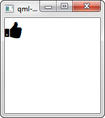

Demo
====

Use
===

1. Add this repository as a submodule to your main Qt project and then add its submodules which includes the 
   [FontAwesome repository](https://github.com/FortAwesome/Font-Awesome)

        git submodule add https://github.com/RossRogers/qml-font-awesome qml-font-awesome
        git submodule foreach --recursive git submodule update --init
        
2. Add `qml-font-awesome` with appropriate paths to your [`qml.qrc` file](http://doc.qt.io/qt-5/qtquick-deployment.html):

        <RCC>
            <qresource prefix="/">
                <file alias="fontawesome.ttf">qml-font-awesome/Font-Awesome/fonts/fontawesome-webfont.ttf</file>
                <file alias="qml-font-awesome/font_awesome.js">qml-font-awesome/font_awesome.js</file>
            </qresource>
        </RCC>
        
3. Load the font in your top window:

        FontLoader {
          name: "font_awesome";
          source: "qrc:/fontawesome.ttf";
        }
        
4. Import the font-awesome unicode declarations in a QML file and use it:

        import "qml-font-awesome/font_awesome.js" as FontAwesome
        
        Item {
          Text {
            font.family: "font_awesome"
            text: FontAwesome.fa_thumbs_up
            font.pointSize: 24
          }
        }
        
        
Updating Font-Awesome Version
=============================

1. Clone and initialize submodules:

         git clone https://github.com/RossRogers/qml-font-awesome
         cd qml-font-awesome
         git submodule update --init
         
2. Pull from FontAwesome repo:

        cd Font-Awesome
        git pull origin master
        git fetch --tags
        
3. Checkout whatever release of Font Awesome you wish:

        git checkout v4.7.0 
        
4. Run `update.py`:

        python update.py
        
5. Commit your edits and tag to Font Awesome release:

        git commit -a -m "Font Awesome v4.7.0"
        git tag v4.7.0
        
        

        

